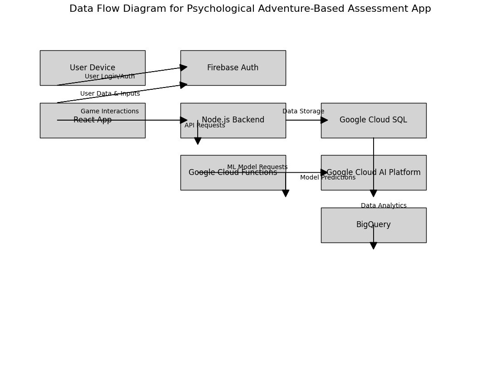

# Psychological Assessment App

This project is a psychological assessment application that utilizes the Rorschach test and Thematic Apperception Test to determine mental health and other aspects. It integrates with Google Cloud products like SQL and AI to process and predict more aspects. The app functions as an adventure game where in-game choices are used to determine the results.

## Table of Contents

- [Features](#features)
- [Technologies](#technologies)
- [Architecture](#architecture)
- [Frontend Setup](#frontend-setup)
- [Backend Setup](#backend-setup)
- [Environment Variables](#environment-variables)
- [Contributing](#contributing)
- [License](#license)

## Features

- Interactive psychological assessment using Rorschach and Thematic Apperception tests.
- Adventure game-like experience to make the assessments engaging.
- Real-time data processing and prediction using Google Cloud AI.
- Secure user authentication with Firebase Authentication.
- Data storage and retrieval using Firebase Firestore.

## Technologies

### Frontend

- React
- React Router
- Firebase Authentication
- Firebase Firestore

### Backend

- Node.js
- Express
- Firebase Admin SDK
- CORS
- Body-parser

### Cloud Services

- Google Cloud AI
- Google Cloud SQL

## Architecture



## Frontend Setup

1. Clone the repository:

```sh
git clone https://github.com/Adi7015YT/Inkblot-Odyssey.git
cd Inkblot-Odyssey/
```

2. Install dependencies:

```sh
npm install
```

3. Create a `.env.production.local` file in the root of the directory with the following content:

```
REACT_APP_FIREBASE_API_KEY=your_api_key
REACT_APP_FIREBASE_AUTH_DOMAIN=your_auth_domain
REACT_APP_FIREBASE_PROJECT_ID=your_project_id
REACT_APP_FIREBASE_STORAGE_BUCKET=your_storage_bucket
REACT_APP_FIREBASE_MESSAGING_SENDER_ID=your_messaging_sender_id
REACT_APP_FIREBASE_APP_ID=your_app_id
```

4. Run the app:

```sh
npm start
```

## Backend Setup

1. Clone the repository (if not already done):

```sh
git clone https://github.com/yourusername/psychological-assessment-app.git
cd psychological-assessment-backend
```

2. Install dependencies:

```sh
npm install
```

3. Create a `serviceAccountKey.json` file in the `backend` directory. Obtain the Firebase service account key from your Firebase console and paste it into this file.

4. Create a `.env` file in the `backend` directory with the following content:

```
PORT=5000
FIREBASE_DATABASE_URL=https://your-database-name.firebaseio.com
```

5. Run the server:

```sh
node server.js
```

## Environment Variables

- **Frontend**: Store Firebase configuration details in a `.env.production.local` file.
- **Backend**: Store the Firebase database URL and other sensitive keys in a `.env` file.

## Contributing

1. Fork the repository.
2. Create your feature branch (`git checkout -b feature/your-feature`).
3. Commit your changes (`git commit -m 'Add some feature'`).
4. Push to the branch (`git push origin feature/your-feature`).
5. Open a pull request.

## License

This project is licensed under the MIT License. See the [LICENSE](LICENSE.md) file for details.
